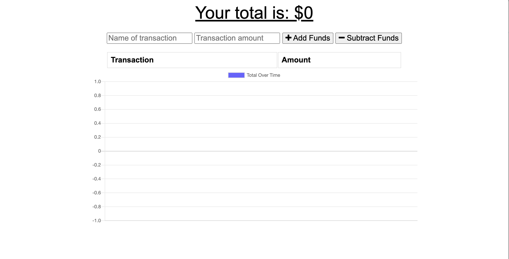

# Offline Tracker PWA 

[Offline Tracker PWA](https://offlinetrackerpwa.herokuapp.com/)

## Description
Track Your Budget With a simple graph and drsign get an overview of your expenses with a simple graph. You as the user will be able to add expenses and deposits to their budget with or without a connection. When entering transactions offline, it populates the total when brought back online. Giving users a fast and easy way to track their money is important, but allowing them to access that information anytime is even more important. Having offline functionality is paramount to our applications success.

## Table of Contents

- [Installation](#installation)
- [User Story](#user)
- [Technology Used](#Technology)
- [Questions](#questions)
- [License](#license)

## User Story
AS AN avid traveller
I WANT to be able to track my withdrawals and deposits with or without a data/internet connection
SO THAT my account balance is accurate when I am traveling

## Technology Used 
* Express
* Mongoose
* MONGO DB 
* Manifest
* Service-Worker
* Composse
## Questions
 Contact me 
EMAIL: Xferreiramat@gmail.com
## License
Content in this project is governed under the MIT License.

To read the license in its entirety, click here: [MIT](./LICENSE)

---

Copyright [2021] [Mateo Ferreira]

